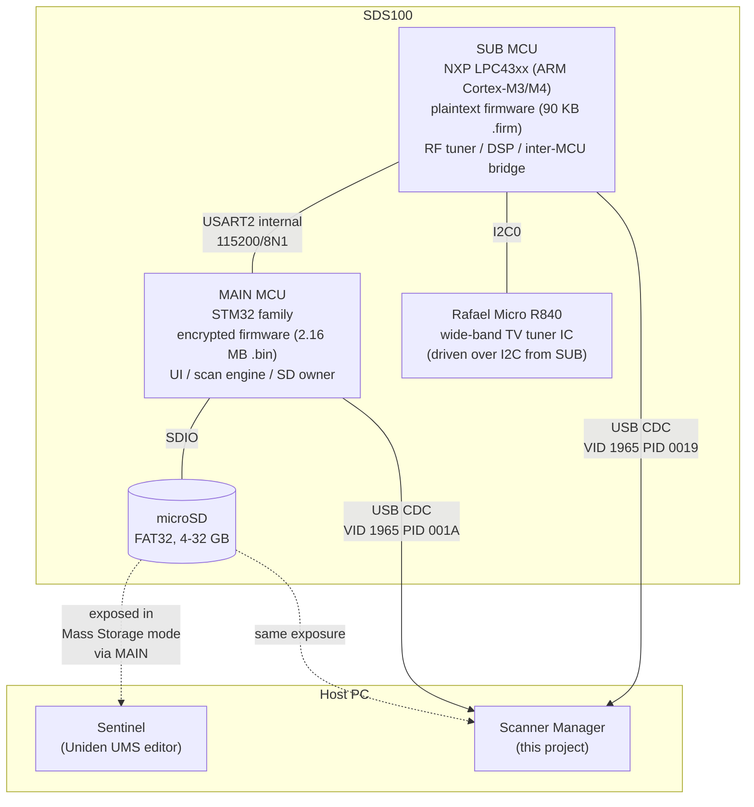
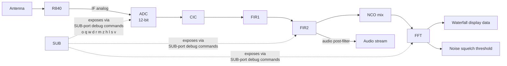

# RE: Architecture

> Status: shipped (v0.11.x) — hardware decomposition reference.

> Where this fits: the structural picture of the SDS100 hardware
> and how we observe it. For the consolidated narrative start at
> [Reverse Engineering](Reverse-Engineering).

## Two MCUs, three buses, one SD card

**Reads** (from outermost to innermost):

1. **The host PC** sees one of two USB topologies, depending on the
   mode the user picked at power-on:
   - Mass Storage mode: MAIN exposes the SD as a SCSI block device.
     Sentinel can do its job, and so can our app.
   - Serial mode: MAIN exposes one CDC port (`PID 001A`), SUB
     exposes a sister CDC port (`PID 0019`). The SD card disappears
     while in this mode. See [RE-USB-Modes](RE-USB-Modes).
2. **MAIN** owns the LCD, keypad, scan engine, SD card, and
   USB-host endpoint. Its firmware is encrypted (entropy 7.9999/8.0)
   so we can't read it statically; everything we know about MAIN
   comes from the live serial command surface plus the published
   Uniden Remote Command Specs (V1.02 + V2.00 + BCDx36HP V1.05).
3. **SUB** owns the RF front-end. It drives the R840 tuner over
   I2C, runs the digital-down-conversion + filter chain
   (CIC -> FIR1 -> FIR2 -> NCO mix -> FFT), produces the waterfall
   data, and feeds I/Q + audio samples back to MAIN.
4. **The two MCUs talk over LPC43xx USART2** at 115200/8N1 with
   no flow control. Path is internal to the SoC - we did not find
   external pin-mux for it. See [RE-Inter-MCU-Bus](RE-Inter-MCU-Bus).
5. **The R840** is a TV tuner IC that the Uniden firmware repurposes
   for a much wider receive surface than its DVB-T2 origin
   suggests. Mode strings `R840_FM`, `R840_DVB_T2_1_7M`, etc. are
   in the SUB firmware string table.

## How signal flows during scan

The 13 SUB-port debug commands give us live taps into every block
of this chain. See [RE-Serial-Protocol](RE-Serial-Protocol) for the
full mapping of command -> DSP block.

## Two USB modes, two surfaces

The user picks at power-on:

| Mode | Surface | What we get | What we can't do |
|---|---|---|---|
| Mass Storage | FAT32 over USB MSC/SCSI | Read/write every persistent file: HPDs, profile, scanner.inf, firmware images, favourites | Anything live (RSSI, GSI, scan state, DSP) |
| Serial | Two USB CDC ports (MAIN + SUB) | Live state via MAIN port commands; DSP/RF debug via SUB port | Read/write SD files (volume disappears) |

These are mutually exclusive on a given session. Our app handles
both, transitioning by asking the user to enter the appropriate
mode for each task. Sentinel only ever uses Mass Storage.

## Firmware versions on the unit we RE'd

Captured from `scanner.inf` and live `MDL`/`VER` queries on
`<HOST>` 2026-04-27:

| Component | Version | Source |
|---|---|---|
| MAIN firmware | 1.26.01 | `VER` on MAIN port; `Scanner` field 3 of `scanner.inf` |
| SUB firmware | 1.03.15 | `VER` on SUB port; `Scanner` field 9 of `scanner.inf` |
| Boot firmware? | 1.00.00 | `Scanner` fields 6/7 (educated guess - DSP / boot loader) |
| Hardware revision | `01` | `Scanner` field 4 |
| Serial number | `<SERIAL>` | `Scanner` field 2 |
| Model fingerprint | `SDS100` | `Scanner` field 1; matches `MDL` on MAIN port |

`scanner.inf`'s 9-field `Scanner` line is BCDx36HP-family-canonical;
the BT885 has the same shape but only 8 fields (no SUB MCU, no
field 9). See [RE-SD-Card](RE-SD-Card).

## Where the SDS200 / SDS150 fit

The Uniden SDS150 (UB3912) and SDS200 (UB3842) are the same
firmware family per the V2.00 spec. We expect them to share:

- Same `BCDx36HP/` SD-card layout.
- Same SUB MCU + firmware container format.
- Same MAIN-port command surface (modulo a few `BAS` / form-factor
  differences).
- Same dual-USB-mode boot prompt.

We have not yet imaged an SDS150 or SDS200 SD card; deltas will be
documented as a sibling page when they're available.
