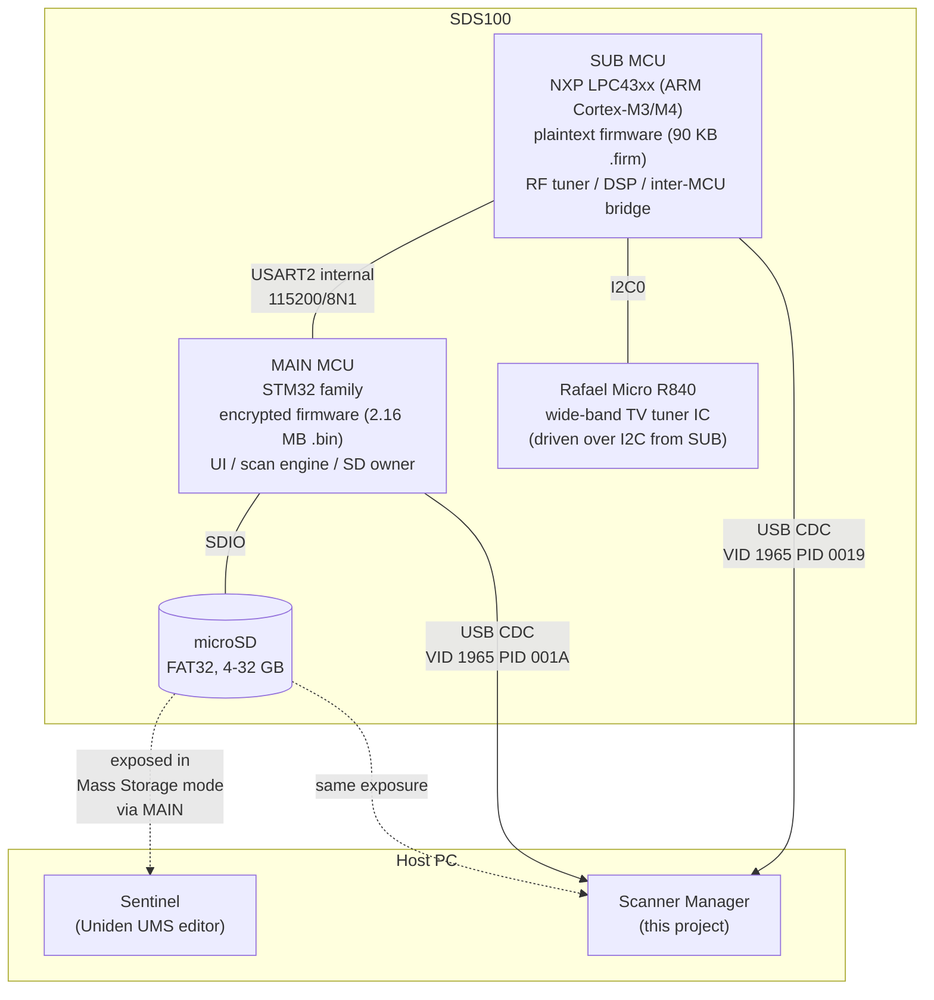
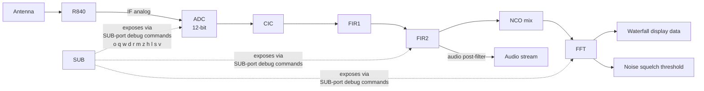

# RE: Architecture

> Status: shipped (v0.11.x) — hardware decomposition reference.

> Where this fits: structural picture of the SDS100. Start at
> [Reverse Engineering](Reverse-Engineering) for the consolidated story.

## What this answers

What hardware is inside an SDS100, which MCU owns which bus, and how
signal / USB / SD traffic flows — so contributors know which surface
to probe for a given question.

## Known vs OPEN

| Topic | State | Notes |
|---|---|---|
| Two-MCU split (MAIN + SUB) | DONE | Live serial + SUB decompile |
| USB dual-mode topology | DONE | See [RE-USB-Modes](RE-USB-Modes) |
| SUB = LPC43xx + R840 tuner | DONE | Strings + peripheral scan |
| MAIN = STM32-family, encrypted FW | DONE (identity); static RE INFEASIBLE | See [RE-Firmware](RE-Firmware) |
| USART2 inter-MCU physical + framing | Layers 0–2 DONE | Layer 3 OPEN — [RE-Inter-MCU-Bus](RE-Inter-MCU-Bus) |
| SDS150 / SDS200 card image | OPEN | Same family expected; no card imaged yet |

## Deep dive

### Two MCUs, three buses, one SD card

**Outermost → innermost:**

1. **Host PC** sees one of two USB topologies (user picks at power-on):
   - Mass Storage: MAIN exposes the SD as SCSI. Sentinel and our app.
   - Serial: MAIN CDC `PID 0x001A` + SUB CDC `PID 0x0019`. SD volume
     disappears. See [RE-USB-Modes](RE-USB-Modes).
2. **MAIN** owns LCD, keypad, scan engine, SD, USB-host endpoint.
   Firmware encrypted — knowledge comes from live serial + published
   Uniden Remote Command Specs (V1.02 + V2.00 + BCDx36HP V1.05).
3. **SUB** owns RF front-end: R840 over I2C, DDC chain
   (CIC → FIR1 → FIR2 → NCO → FFT), waterfall data, I/Q + audio to MAIN.
4. **USART2** at 115200/8N1, no flow control, SoC-internal (no external
   pin-mux). See [RE-Inter-MCU-Bus](RE-Inter-MCU-Bus).
5. **R840** — TV tuner IC repurposed for wide receive. Mode strings
   `R840_FM`, `R840_DVB_T2_1_7M`, etc. in SUB string table.

### How signal flows during scan

The 13 SUB-port debug commands tap every block. Mapping:
[RE-Serial-Protocol](RE-Serial-Protocol).

### Two USB modes, two surfaces

| Mode | Surface | What we get | What we can't do |
|---|---|---|---|
| Mass Storage | FAT32 over USB MSC/SCSI | Read/write persistent files | Anything live |
| Serial | Two USB CDC ports | Live MAIN commands + SUB DSP debug | SD file I/O (volume gone) |

Mutually exclusive per session. Sentinel only uses Mass Storage.

### Firmware versions on the unit we RE'd

Captured from `scanner.inf` and live `MDL`/`VER` on `<HOST>` 2026-04-27
(later Session 4 bumped MAIN/SUB):

| Component | Version | Source |
|---|---|---|
| MAIN firmware | 1.26.01 (was 1.23.07 on first card image) | `VER` on MAIN; `scanner.inf` field 3 |
| SUB firmware | 1.03.15 (was 1.03.05 on first card image) | `VER` on SUB; `scanner.inf` field 9 |
| Boot / DSP fields | 1.00.00 | `scanner.inf` fields 6/7 (educated guess) |
| Hardware revision | `01` | field 4 |
| Model fingerprint | `SDS100` | field 1; matches `MDL` on MAIN |

`scanner.inf`'s 9-field `Scanner` line is BCDx36HP-canonical; BT885
has 8 fields (no SUB / no field 9). See [RE-SD-Card](RE-SD-Card).

### Where SDS200 / SDS150 fit

Same firmware family per V2.00 spec. Expect same `BCDx36HP/` layout,
SUB container, MAIN command surface (modulo form-factor), dual USB
modes. **No SDS150/SDS200 card imaged yet** — deltas go on a sibling
page when available. Lab note: SDS100.md treats SDS200 as ~99% shared.

## Lab pointers

| Path | Role |
|---|---|
| `Metacache/Dev/RE/docs/SDS100.md` | Primary SDS100 lab notebook |
| `Metacache/Dev/RE/docs/sub_static_analysis.md` | LPC43xx / peripheral / string analysis |
| `Metacache/Dev/RE/firmware/decompiles/` | Per-function Ghidra JSON/MD (GitLab-heavy) |
| `Metacache/Dev/RE/docs/SDS100_inter_mcu_protocol.md` | USART2 bit-level lab write-up |
| `Metacache/Dev/RE/tools/probes/list_ports.py` | Confirm dual-CDC topology live |
