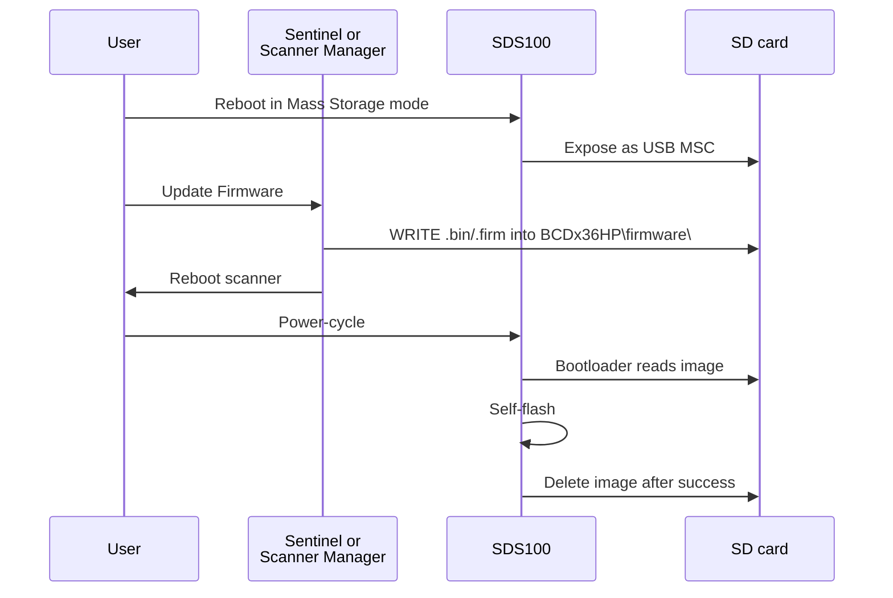

# RE: Firmware

> Status: shipped (v0.11.x) — static RE + in-app updater over FTP/SD.

> Where this fits: how MAIN/SUB firmware blobs are packaged, which
> one we can read statically, and how updates land on the card.
> Start at [Reverse Engineering](Reverse-Engineering).

## What this answers

Why MAIN static RE is a dead end, how the SUB `.firm` container
works, what the SUB strings reveal about the DSP chain, and how
firmware updates are applied (SD drop + reboot — no decrypt needed).

## Known vs OPEN

| Topic | State | Notes |
|---|---|---|
| MAIN encryption (family-wide since 2014) | DONE — INFEASIBLE for static RE | Inventory in lab |
| SUB container format + inflate | DONE | `inflate_sub.py` |
| SUB Ghidra import + dispatch | DONE | See serial + inter-MCU pages |
| In-app FTP + SD updater | SHIPPED (v0.11.x) | `firmware/updater.py` |
| MAIN decrypt / JTAG dump | OPEN / impractical | No exposed SWD |
| Trigger for remaining SUB format strings | OPEN | Mode-sweep |

## Deep dive

### Summary

| MCU | Extension | Format | Static RE |
|---|---|---|---|
| MAIN (STM32 family) | `.bin` (~2.16 MB) | Encrypted (entropy ~7.9999/8) | **INFEASIBLE** |
| SUB (LPC43xx) | `.firm` (~88–90 KB) | Plaintext ARM in thin container | **DONE** |

### MAIN — sealed blob

Across BCDx36HP family releases (2014→2026), every MAIN image:
maxed entropy in all 64 KiB chunks, no plaintext header/footer,
~99.6% byte churn between versions, zero shared strings across
builds. Bootloader decrypts with a hardware-fused key. No practical
software-only key recovery.

**Implications:** don't burn cycles on MAIN static RE. Learn MAIN
behaviour from live serial + specs ([RE-Serial-Protocol](RE-Serial-Protocol)).
**Flashing does not need decrypt** — drop `.bin` on SD; bootloader
handles it. Updater shipped in v0.11.x
([RE-Update-Endpoints](RE-Update-Endpoints)).

### SUB — plaintext container

Layout (1.03.15):

```
Offset    Size  Field
00000000   12   "SDS-100-SUB\0"
0000000C   12   0xFF padding
00000018   16   "Version 1.03.15 \0"
00000028    4   payload_end_offset = 0x16080
0000002C    4   header_size_marker  = 0x80
00000030    4   total_file_size_minus_4
00000034   12   0xFF padding
00000080  ...   plaintext ARM Cortex-M payload (~90 KB)
...             trailing CRC + footer "SDS-100-SUB\0"
```

CRC-32 of `[0x00, payload_end)` matches trailer. Early notes that
called SUB “mostly compressed” were **wrong** (coincidental zlib
magic in ARM code) — corrected Session 6+.

**Architecture from strings:** LPC43xx (`lpc43xx_i2c.c` path), R840
tuner, DDC chain ADC→CIC→FIR1→FIR2→NCO→FFT, four-stage AGC
(LNA1/LNA2/Mixer/VGA). Vector table: SP `0x10020000`, Reset
`0x140001D5` (Thumb). UART1 was an early inter-MCU guess —
**superseded** by USART2 ([RE-Inter-MCU-Bus](RE-Inter-MCU-Bus)).

**Status format bump 1.03.05 → 1.03.15:** trailing `%04X` added to
`S%02X…` format; trigger mnemonic still unknown.

### Update mechanism (SD delivery)



Rules (Uniden readme): Mass Storage only; never touch
`CityTable_*.dat` / `ZipTable_*.dat`; never place two `.bin` files
at once; same flow for `.firm` SUB. Sentinel is a UI wrapper around
this. Our app: `firmware/updater.py` + Firmware dock.

**Side effect (MAIN 1.23.07 → 1.26.01):** `LCR` location wiped;
`SVC`/`FQK`/favourites preserved; GSI schema richer. Warn users to
re-enter location after MAIN update.

## Lab pointers

| Path | Role |
|---|---|
| `Metacache/Dev/RE/docs/SDS100_firmware.md` | Raw firmware RE write-up |
| `Metacache/Dev/RE/docs/uniden_firmware_inventory.md` | Family entropy / FTP goodies |
| `Metacache/Dev/RE/tools/firmware/inflate_sub.py` | SUB container extractor |
| `Metacache/Dev/RE/tools/firmware/firmware_strings.py` | Strings + version diff |
| `Metacache/Dev/RE/tools/firmware/firmware_structure.py` | Entropy / magic / byte diff |
| `Metacache/Dev/RE/tools/automation/` | Ghidra bootstrap + headless |
| `Metacache/Dev/RE/firmware/` | Blobs + Ghidra projects (export-tiered) |
| `Metacache/Dev/RE/firmware_analysis/` | Public strings dumps |
| Prod client | `firmware/ftp_client.py`, `firmware/updater.py` (repo root package) |
