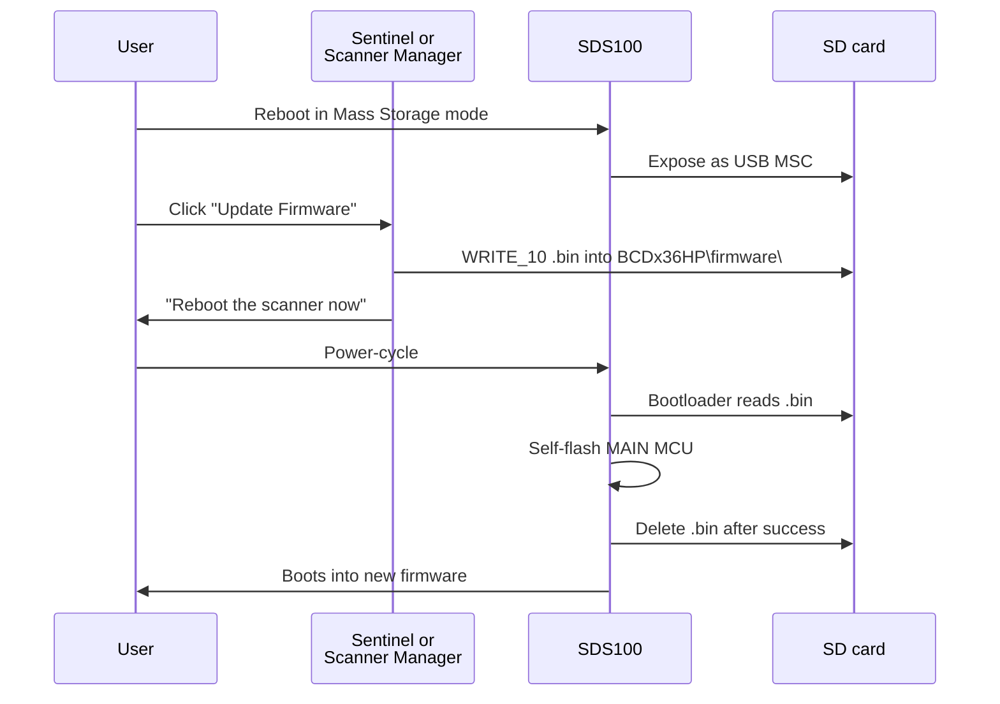

# RE: Firmware

> Where this fits: how the SDS100's two firmware blobs (MAIN + SUB)
> are packaged, which one we can read statically, and how
> firmware updates actually flow. For the consolidated narrative
> start at [Reverse Engineering](Reverse-Engineering).

## Summary

| MCU | File extension | Format | Static-RE feasibility |
|---|---|---|---|
| MAIN (STM32 family) | `.bin` (~2.16 MB) | Encrypted blob - entropy 7.9999/8.0 | **INFEASIBLE** - sealed. Bootloader decrypts from a hardware-fused key |
| SUB (NXP LPC43xx) | `.firm` (~88-90 KB) | Plaintext ARM Cortex-M payload in a thin container | **DONE** - extracted, Ghidra-imported, decompiled |

## MAIN firmware - encrypted, dead end for static RE

### Evidence

We applied the standard "is this thing encrypted?" battery to two
MAIN images (`SDS-100_V1_23_07.bin`, `SDS-100_V1_26_01.bin`), then
on 2026-05-03 expanded the test across the **entire BCDx36HP family,
12 years of releases, and every accessible variant** (govt / fleet /
EU / regional). Findings held uniformly:

- Whole-file Shannon entropy: **7.9999 / 8.0** (essentially maximum)
  on every blob from BCD436HP V1.03 (2014) to SDS-100 V1.26.01 (2026).
- All 33 of 33 64-KiB chunks score 7.9965-7.9978 bits/byte. **No
  unencrypted region anywhere in any file.**
- First 64 and last 64 bytes look statistically random across all
  samples. No plaintext header, footer, length field, magic bytes,
  signature block, or metadata - in any version.
- String extraction: thousands of "strings" per file with **zero
  overlap** between any two files (same model different versions,
  same version different models, civilian vs government). Real
  firmware versions of the same product share thousands of strings
  (error messages, format strings, command names); zero overlap is
  the signature of strong encryption with version-specific keys/IVs.
- Byte-level diff: **~99.6% of bytes changed** across every pair we
  tested - same-version cross-model, consecutive versions, civilian
  vs government, oldest vs newest. Distribution is uniform; no large
  unchanged region.

Encryption was already in place on the very first BCDx36HP firmware
(BCD536HP V1.02.03 from 2014-01-18). There is no "earlier-era
plaintext" loophole; Uniden's MAIN-side opacity has been continuous
across the entire product line. Full inventory and per-pair diffs in
`Metacache/Dev/RE/docs/uniden_firmware_inventory.md`.

### Conclusion

The Main MCU firmware ships as a **sealed encrypted blob** that the
on-device bootloader decrypts using a hardware-fused key (probably
in the STM32's OTP or a paired security IC). We have no practical
way to recover the key from a software-only attack:

- We cannot extract the bootloader from a working device (no JTAG /
  SWD interface exposed).
- We cannot guess the key (256-bit search space).
- We cannot side-channel attack without specialised power-analysis
  hardware.
- We cannot dump the STM32 die without electron microscopy.

**Static RE on MAIN firmware is infeasible** for this project.
Document this loudly so future maintainers don't re-try it.

### What this means for the project

- **In-app firmware updater is unaffected.** We don't need to
  decrypt to flash; the bootloader does that. We just copy bytes
  to the SD card.
- **Live serial RE is the only path to learn what MAIN does** at
  runtime. The V1.02 + V2.00 specs + our captures of GSI / GLT /
  STS / GLG are the canonical surface. See
  [RE-Serial-Protocol](RE-Serial-Protocol).
- **No undocumented MAIN commands extractable from firmware.**
  They're not.

## SUB firmware - plaintext, fully analysed

### Container format

The Sub `.firm` is **not encrypted**. It's a thin header / footer
wrapping a plaintext ARM Cortex-M payload. Layout for the
1.03.15 version:

```
Offset    Size  Field
00000000   12   "SDS-100-SUB\0"        (model magic, ASCII + NUL)
0000000C   12   0xFF padding
00000018   16   "Version 1.03.15 \0"   (version string, space + NUL padded)
00000028    4   payload_end_offset = 0x16080
0000002C    4   header_size_marker  = 0x80 (= payload start)
00000030    4   total_file_size_minus_4
00000034   12   0xFF padding
00000080  ...   <plaintext ARM Cortex-M payload, 90,076 bytes>
0001605C   28   trailing CRC + footer block
EOF-12     12   "SDS-100-SUB\0"        (footer magic)
```

CRC-32 of `[0x00, 0x16080)` matches the trailing 4-byte CRC field
exactly - integrity check confirmed.

> Earlier RE notes (Session 4) reported the SUB firmware as "mostly
> compressed code" with putative zlib + LZMA1 chunks. **That was
> wrong.** The "zlib magic" hits in the structural scan were
> coincidental matches in plaintext ARM machine code. Corrected
> Session 6+.

### Architecture decoded from real strings

The SUB firmware leaks the entire RF / DSP architecture in printf
format strings, debug labels, and source-file paths.

#### SUB MCU = NXP LPC43xx (ARM Cortex-M3/M4)

```
../src/lpc43xx_i2c.c
```

That source path is from the **NXP LPC43xx series** - an ARM
Cortex-M4 + Cortex-M0 dual-core SoC (LPC4350/LPC4357 family).
Identifies the SUB processor unambiguously.

#### Reset vector

First 16 32-bit words of the payload form a Cortex-M vector table:

| Index | Vector | Value | Notes |
|---|---|---|---|
| 0 | Initial SP | `0x10020000` | LPC43xx local SRAM bank 0 top (0x10000000+128 KB) |
| 1 | Reset PC | `0x140001D5` | Thumb bit set; entry at flash 0x140001D4 |
| 2 | NMI | `0x14005A89` | flash |
| 3 | HardFault | `0x14005AAB` | flash |
| 11 | SVCall | `0x14005AAD` | flash |
| 14 | PendSV | `0x14005AAF` | flash |
| 15 | SysTick | `0x10006295` | **SRAM** - copy-on-boot routine |

Most exception handlers live in `0x14000000+` SPIFI flash; SysTick
is in SRAM, indicating a `.fastcode`-style copy at boot.

#### RF tuner = Rafael Micro R840

```
R840_FM
R840_DVB_T2_1_7M
```

The Rafael Micro **R840** is a wideband silicon TV tuner IC
(originally for DVB-T2 demodulation) which Uniden uses as the
wide IF tuner in the SDS100. The SUB MCU drives it over I2C0
(matches the `lpc43xx_i2c.c` source path).

#### Digital signal-path

```
ADC P-P, %d, %fmV
CIC OUT   min,%6d,  max=%6d, err=%6d
FIR1 OUT  min,%6d,  max=%6d, err=%6d
FIR2 OUT  min,%6d,  max=%6d, err=%6d
FFT_PEAK,%ddB
FFT_FREQ,%d
NCO_Range,min=%6d, max=%6d, dif=%6d
Noise Squelch,%6d
Window,%d
IF=%d, STD= %s
```

Complete textbook DDC chain:
**RF -> R840 -> IF analog -> ADC -> CIC -> FIR1 -> FIR2 -> NCO mix -> FFT**

Implications:
- Waterfall data we see in `GST` and `GWF` is computed on SUB,
  shipped over USART2 to MAIN for display.
- Squelch is **digital, computed in DSP** (`Noise Squelch`).
- The 13 SUB-port debug commands (see [RE-Serial-Protocol](RE-Serial-Protocol))
  give live taps into every block of this chain.

#### Gain chain

```
RF_gain_comb,%d, LNAGain1,%d, LNAGain2,%d, MixerGain,%d
RF_GainMode,MANUAL  /  RF_GainMode,AUTO
VGA Mode Auto(Pin)  /  VGA Mode Manual,%d
LNAGain1,Auto / LNAGain1,%d
RssiDbm,%d
IfRssi,%d
```

Four-stage AGC: **LNA1 -> LNA2 -> Mixer -> VGA**. Each stage can be
individually `Auto` or `Manual`. `RssiDbm` is the post-conversion
RSSI in dBm (this is what `PWR` reports on MAIN).

### LPC43xx peripheral usage (32-bit constant scan)

| Peripheral | Base | Refs in payload | Role |
|---|---|---:|---|
| `SRAM_BANK0` | `0x10000000` | many | RAM access |
| `ADC1` | `0x400E4000` | 8 | ADC sampling for IF |
| `SCT` | `0x40000000` | 9 | Timer / DMA pacing |
| `UART1` | `0x40082000` | 6 | Originally suspected as inter-MCU bus; **superseded** - actual bus is USART2 (see [RE-Inter-MCU-Bus](RE-Inter-MCU-Bus)) |
| `SSP0` | `0x40083000` | 6 | SPI - external peripheral |
| `USB0` | `0x40006000` | 5 | USB CDC port to host |
| `I2C0` | `0x400A1000` | low | Drives R840 tuner |
| `I2S0/I2S1` | `0x400A2000/3000` | 0 | Accessed via struct-pointer indirection, not direct literals |

### SUB-port status format diff (1.03.05 -> 1.03.15)

The most interesting concrete protocol change between SUB versions:

```
1.03.05:  S%02X%04X%04X%04X%04X%01X
1.03.15:  S%02X%04X%04X%04X%04X%01X%04X     (added one trailing %04X field)
```

So the SUB processor's status report format added a new 16-bit
field in 1.03.15. The mnemonic that triggers it is unknown - it's
one of the 35 untriggered format strings that probably correspond
to alt-mode outputs of `t`/`u` mode flags.

## Firmware update mechanism

This was opaque through Sessions 1-3 because we never opened the
update ZIPs. Session 4 cracked it: **it's all SD-card delivery**.



Per Uniden's update readme:

1. Scanner in **Mass Storage** mode (NOT Serial mode).
2. Drop the new `.bin` (Main MCU) into `BCDx36HP/firmware/`. **NEVER**
   touch `CityTable_*.dat` or `ZipTable_*.dat` (those are required
   for boot - Uniden's readme warns removal will brick startup).
3. **NEVER place more than one `.bin`** in the folder simultaneously
   ("the upload will not start or will not be uploaded correctly").
4. Reboot the scanner. The onboard bootloader on MAIN MCU reads the
   `.bin` from SD on next boot and self-flashes.
5. Scanner deletes the `.bin` after successful flash.
6. **Same procedure for Sub firmware** with `.firm` extension.

**Sentinel is just a UI wrapper around this procedure.** It puts
the scanner in Mass Storage mode (asks the user to do this, since
Sentinel can't trigger the mode switch over USB), copies the file,
prompts for reboot. Nothing magic.

This unblocks an in-app firmware updater in our app - we already
own the SD card path; copying a file is trivial. See
`Metacache/Dev/FIRMWARE_UPDATER.md`
for the implementation plan.

### Side effects observed across firmware update

Captured during MAIN 1.23.07 -> 1.26.01 update:

| Setting | Pre-update | Post-update | Behaviour |
|---|---|---|---|
| `LCR` (location) | `<LAT>,<LON>,10.0` | `0.000000,-0.000000,0.0` | **Wiped** |
| `SVC` (service-type mask) | unchanged | unchanged | Preserved |
| `FQK` (Favorites Quick Key) | unchanged | unchanged | Preserved |
| GSI XML schema | basic | richer (added `SvcType`, `UnitID Name`, `SAD`) | Improved |
| Favourites + system data | preserved | preserved | (good) |

**Implication for our app**: warn users that their location/range
setting will need re-entering after a MAIN firmware update.

## Lab data

- `Metacache/Dev/RE/firmware` - all firmware images, extracted SUB payload, decompiles, Ghidra dump.
- `Metacache/Dev/RE/docs/SDS100_firmware.md` - the original raw write-up that this page consolidates.
- `Metacache/Dev/RE/tools/firmware/inflate_sub.py` - SUB container parser/extractor.
- `Metacache/Dev/RE/tools/firmware/firmware_strings.py` - per-image ASCII run extractor + version-diff.
- `Metacache/Dev/RE/tools/firmware/firmware_structure.py` - entropy profile + magic-byte signature scan + byte-level diff.
- `Metacache/Dev/RE/automation` - Ghidra bootstrap, headless analysis, and Java pre/post scripts.
