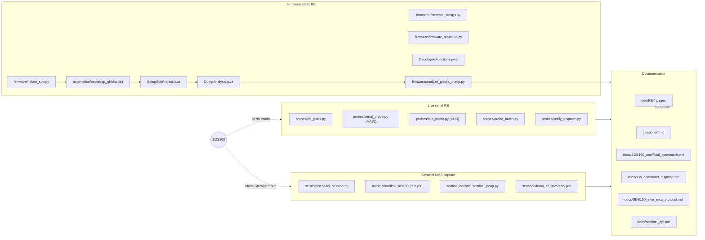

# RE / Development: Toolchain

> Where this fits: every script and tool we use to do RE on the
> SDS100, grouped by purpose. For the consolidated narrative
> start at [Reverse Engineering](Reverse-Engineering).

All paths below are relative to the repo root. Every script is
self-contained Python (or PowerShell for Windows-specific bits)
and is checked into the repo for reproducibility.

The full source-of-truth for tool inventory + per-tool docstrings is
[`Metacache/Dev/RE/tools/README.md`](../../tree/main/Metacache/Dev/RE/tools).
Below is the audience-friendly summary; if it disagrees with the
folder README, the folder README wins.

## One-time host setup

| Tool | Purpose | Install |
|---|---|---|
| **Python 3.10+** | Probe scripts, decoders, analyzers | `winget install Python.Python.3.13` (or any 3.10+) |
| **pyserial** | USB CDC access for probes | `py -m pip install --user pyserial` |
| **Java 21 JDK** | Required by Ghidra | `winget install --id EclipseAdoptium.Temurin.21.JDK -e --source winget` |
| **Ghidra** | Static analysis of SUB firmware | `powershell -ExecutionPolicy Bypass -File Metacache\Dev\RE\tools\automation\bootstrap_ghidra.ps1` (auto-installs latest to `<GHIDRA_INSTALL>\`) |
| **LPC43xx SVD** | Peripheral overlay for Ghidra | `powershell -ExecutionPolicy Bypass -File Metacache\Dev\RE\tools\automation\fetch_lpc43xx_svd.ps1` |
| **Wireshark** | tshark for pcap decoding | `winget install --id WiresharkFoundation.Wireshark -e --source winget` |
| **USBPcap** | USB packet capture (Sentinel sessions) | `winget install --id desowin.USBPcap -e --source winget` (reboot after) |

Verify everything with:

```pwsh
powershell -ExecutionPolicy Bypass -File Metacache\Dev\RE\tools\automation\check_prereqs.ps1
```

## Live serial probes (require scanner in Serial mode)

| Script | What it does | Safety |
|---|---|---|
| `Metacache/Dev/RE/tools/probes/list_ports.py` | Maps Uniden VID-1965 USB CDC PIDs to COM ports | read-only |
| `Metacache/Dev/RE/tools/probes/serial_probe.py` | MAIN-port (PID 0x001A) command sweep with whitelist + forbidden list | **safe by construction** - hard-coded refusal of mutating commands |
| `Metacache/Dev/RE/tools/probes/sub_probe.py` | SUB-port (PID 0x0019) alphabet attack with anchor-and-compare buffer-leak detection | safe |
| `Metacache/Dev/RE/tools/probes/probe_batch.py` | Batch probe driver, full multi-line response capture, role-based port resolution | safe (operator-defined batch list) |
| `Metacache/Dev/RE/tools/probes/verify_dispatch.py` | Live-falsifies Ghidra-predicted SUB commands; classifies HIT / ERR / IDENTITY / TIMEOUT | safe |

All probes auto-detect the right Uniden CDC port via VID/PID. Pass
`--port COM5` (or `/dev/ttyACM0`, etc.) to override.

Probe-safety rules baked into the scripts:

- **Whitelist-only.** New mnemonics may be added to
  `serial_probe.py`'s `QUERIES` list **only after** confirming in the
  Uniden Operation Specification that they have no "set" semantics.
- **Hard-coded forbidden list.** `KEY`, `PRG`, `EPG`, `JNT`, `JPM`,
  `WPL`, `WPS`, `CLR`, `DLA`, `MEMSET`, `WIPE`, `TGW`, `VLO`, `SLO`,
  `BFH`, `RST,SET`, `POF`, `GW2`, `GWF` will never be sent regardless
  of the whitelist.
- **No `,?` -> `set` escalation.** Even if the scanner answers `OK`
  to a `cmd,?` write-test, we do NOT follow up with an actual
  `cmd,value`.
- **Read-only by default.** Anything mutating MUST require
  `--allow-destructive` (or equivalent) opt-in.

## Sentinel USB capture (require scanner in Mass-Storage mode)

| Script | What it does |
|---|---|
| `Metacache/Dev/RE/tools/sentinel/sentinel_session.py` | Guided pcap capture: auto-detects USBPcap interface, prompts user through 6 Sentinel ops, optionally invokes the decoder. Default `--rotate-output` mitigates USBPcap's "invalid write handle" bug on repeat runs. |
| `Metacache/Dev/RE/tools/automation/find_sds100_hub.ps1` | Maps SDS100 (VID 1965) to its USBPcap interface deterministically via Windows PnP API |
| `Metacache/Dev/RE/tools/sentinel/decode_sentinel_pcap.py` | SCSI/UMS/FAT32 decoder: produces `.scsi.jsonl` + `.disk.bin` + `.files.md` + `.summary.md` per pcap |
| `Metacache/Dev/RE/tools/sentinel/show_scsi.py` | Pretty-printer for `.scsi.jsonl` output (LBA + blocks + sha) |
| `Metacache/Dev/RE/tools/sentinel/dump_sd_inventory.ps1` | Walks SDS100 SD card when mounted, produces inventory MD + TSV |
| `Metacache/Dev/RE/tools/sentinel/decode_pcap.py` | Older CDC decoder (pre-Phase-0b finding); **superseded** by `decode_sentinel_pcap.py` for Sentinel pcaps. Retained for hypothetical future captures of CDC-mode protocols. |
| `Metacache/Dev/RE/tools/sentinel/compare_cards.py` | Read-only side-by-side of BT885 vs SDS100 SD cards. |

## Firmware extraction + analysis

All firmware tools accept `--firmware <path>`; the default is the
most recent `*_inflated.bin` in `Metacache/Dev/RE/firmware/`, so the same
scripts work for any future SUB firmware version.

| Script | What it does |
|---|---|
| `Metacache/Dev/RE/tools/firmware/inflate_sub.py` | Parses SUB `.firm` container header, extracts plaintext ARM payload. Auto-discovers the most recent `*.firm` in `firmware/`. |
| `Metacache/Dev/RE/tools/firmware/firmware_strings.py` | ASCII run extractor, version-diff between firmware images, command-mnemonic candidate scan. Auto-discovers all MAIN/SUB blobs. |
| `Metacache/Dev/RE/tools/firmware/firmware_structure.py` | Per-image entropy profile, head/tail hex, magic-byte signature scan, byte-level diff between consecutive versions. |
| `Metacache/Dev/RE/tools/firmware/check_sub_strings.py` | Confirms presence of identity / version strings in SUB firmware |
| `Metacache/Dev/RE/tools/firmware/sub_static_analysis.py` | LPC43xx peripheral constant scan, mnemonic candidate clustering (best-effort without Ghidra) |
| `Metacache/Dev/RE/tools/firmware/correlate_responses.py` | Joins SUB-probe hits against firmware string table by regex-converting printf format strings |
| `Metacache/Dev/RE/tools/firmware/find_parser.py` | Locates command parser in `analysis_dump.json` and raw firmware |
| `Metacache/Dev/RE/tools/firmware/find_mdl_handler.py` | Traces literal-pool refs to `MDL`/`VER` response strings |
| `Metacache/Dev/RE/tools/firmware/extract_dispatch.py` | Extracts (byte, fn-ptr) dispatch table candidates with SRAM<->flash address remapping. Configurable `--table-ptr`. |
| `Metacache/Dev/RE/tools/firmware/inspect_func.py` | Inspects a single decompiled function for parser-like patterns |

## Ghidra automation

| File | What it does |
|---|---|
| `Metacache/Dev/RE/tools/automation/check_prereqs.ps1` | Read-only audit of all prereqs |
| `Metacache/Dev/RE/tools/automation/bootstrap_ghidra.ps1` | Idempotent install of Ghidra to `<GHIDRA_INSTALL>` |
| `Metacache/Dev/RE/tools/automation/fetch_lpc43xx_svd.ps1` | Downloads LPC43xx SVD (peripheral overlay) |
| `Metacache/Dev/RE/tools/automation/run_ghidra_setup.ps1` | Drives `analyzeHeadless.bat` for the SUB firmware: import + setup + auto-analyze + JSON dump |
| `Metacache/Dev/RE/tools/automation/run_ghidra_decompile.ps1` | Targeted decompile of specific functions (env-var driven) |
| `Metacache/Dev/RE/tools/automation/ghidra_scripts/SetupSubProject.java` | Pre-script: memory map (flash @0x14000000, SRAM @0x10000000), SVD load, Thumb mode default, ASCII strings min length 3 |
| `Metacache/Dev/RE/tools/automation/ghidra_scripts/DumpAnalysis.java` | Post-script: emits `analysis_dump.json` with metadata, strings, functions, peripheral users, dispatch candidates |
| `Metacache/Dev/RE/tools/automation/ghidra_scripts/DecompileFunctions.java` | Post-script: full C decompile + callers + callees + peripheral access + string xrefs of selected functions |
| `Metacache/Dev/RE/tools/firmware/analyze_ghidra_dump.py` | Consumes `analysis_dump.json`, generates the markdown reports |
| `Metacache/Dev/RE/tools/firmware/decompile_pull.py` | Front-end to `run_ghidra_decompile.ps1` (specify targets, list existing, show one) |

## Archived / historical

Lives under `Metacache/Dev/RE/tools/legacy/` (see its `README.md`). Kept for
reproducibility of early findings; **do not build on these**:

| Script | What it did | Canonical replacement |
|---|---|---|
| `tools/legacy/com6_listen.py` | Listen-only baud sweep (early days of figuring out which CDC port is what) | `tools/probes/serial_probe.py` (passive mode) |
| `tools/legacy/com3_probe.py` | Per-character SUB probe (early iteration) | `tools/probes/sub_probe.py` |
| `tools/legacy/glt_chain.py` | GLT index-chain walker (Session 3) | `tools/probes/serial_probe.py --mode poll --poll-cmd GLT` |
| `tools/legacy/sub_one_shot.py` | One-off SUB probe for a specific mnemonic | `tools/probes/sub_probe.py --char <c>` |
| `tools/legacy/sub_probe_remainder.py` | Resume SUB probe from a partial run | `tools/probes/sub_probe.py` |
| `tools/legacy/check_sub_alive.py` | One-shot ping of SUB port | `tools/probes/list_ports.py` |
| `tools/legacy/test_toggles.py` | Run `q`/`r` before/after `t`/`u` toggles | `tools/probes/serial_probe.py --mode diff` |

## How the layers fit together



The wiki pages are the **canonical** human-facing narrative; the
lab notebook in `Metacache/Dev/RE/` is where reproducibility lives.
