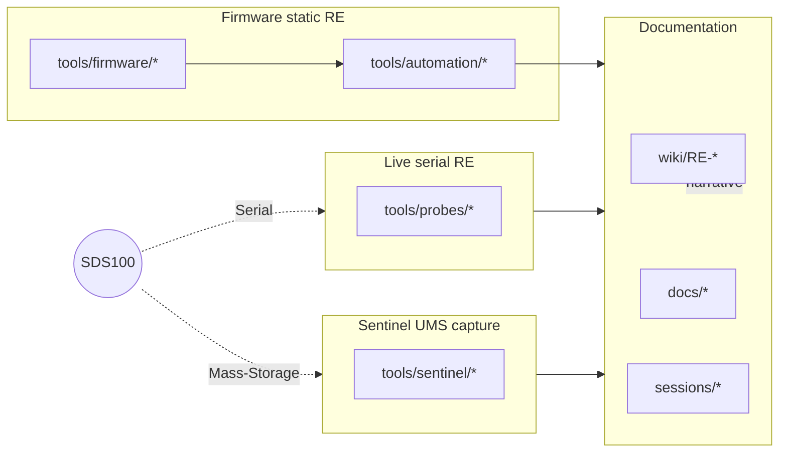

# RE / Development: Toolchain

> Status: shipped (v0.11.x) — script inventory under `Metacache/Dev/RE/tools/`.

> Where this fits: what tools exist for SDS100 RE, grouped by purpose.
> Start at [Reverse Engineering](Reverse-Engineering).

## What this answers

Which scripts to reach for (live probe, Sentinel capture, firmware
static RE, Ghidra), where the full inventory lives, and the safety
contract for serial probes.

## Known vs OPEN

| Topic | State | Notes |
|---|---|---|
| Canonical `tools/` layout | DONE | probes / firmware / sentinel / automation / legacy |
| Probe safety contract | DONE | Whitelist + forbidden + no `,?` escalation |
| Ghidra headless automation | DONE | Bootstrap + setup + decompile |
| Legacy scripts | Archived | Do not build on `tools/legacy/` |

## Deep dive

All paths relative to repo root. **Source of truth for every script
one-liner:** [`Metacache/Dev/RE/tools/README.md`](../Metacache/Dev/RE/tools/README.md).
If this page disagrees with that README, the README wins. Export
tiers: [`Metacache/EXPORT_POLICY.md`](../Metacache/EXPORT_POLICY.md).

### One-time host setup

| Tool | Purpose |
|---|---|
| Python 3.11+ + `pyserial` | Probes / decoders |
| Java 21 JDK + Ghidra | SUB static analysis |
| LPC43xx SVD | Peripheral overlay |
| Wireshark + USBPcap | Sentinel USB capture |

Bootstrap helpers under `Metacache/Dev/RE/tools/automation/`
(`check_prereqs.ps1`, `bootstrap_ghidra.ps1`, `fetch_lpc43xx_svd.ps1`).
Full install recipe: [RE-Workflows](RE-Workflows) § Bootstrap.

### Tool groups (summary)

| Group | Path | Use when |
|---|---|---|
| **Live serial probes** | `tools/probes/` | Scanner in Serial mode — `list_ports`, `serial_probe`, `sub_probe`, `probe_batch`, `verify_dispatch` |
| **Sentinel / UMS** | `tools/sentinel/` | Mass Storage — session capture, SCSI decode, SD inventory, card compare |
| **Firmware static** | `tools/firmware/` | Offline — inflate SUB, strings, entropy, Ghidra dump consumers |
| **Automation** | `tools/automation/` | Ghidra install/headless, hub find, prereq check |
| **Legacy** | `tools/legacy/` | Historical only — see its README for replacements |

Shared helpers: `tools/_common.py` (VID/PID, path constants, blob
resolver).

### Probe safety (baked into scripts)

- **Whitelist-only** for MAIN mnemonics (cite Uniden spec before adding).
- **Hard forbidden:** `KEY`, `PRG`, `EPG`, `JNT`, `JPM`, `WPL`, `WPS`,
  `CLR`, `DLA`, `MEMSET`, `WIPE`, `TGW`, `VLO`, `SLO`, `BFH`,
  `RST,SET`, `POF`, `GW2`, `GWF` (and related) — never sent from probes.
- **No `,?` → set escalation.**
- **Mutating ops** require explicit `--allow-destructive` (or equivalent).

Canonical text: `Metacache/Dev/RE/README.md` § Safety contract.

### How the layers fit together

Wiki = human narrative; `Metacache/Dev/RE/` = reproducibility.

## Lab pointers

| Path | Role |
|---|---|
| `Metacache/Dev/RE/tools/README.md` | **SSOT** full script catalog + common workflows |
| `Metacache/Dev/RE/tools/legacy/README.md` | Superseded scripts → replacements |
| `Metacache/Dev/RE/docs/AUTOMATION.md` | Automation troubleshooting |
| `Metacache/Dev/RE/docs/ghidra_import_runbook.md` | Ghidra import playbook |
| `Metacache/Dev/RE/sessions/` | Probe / capture outputs |
| [RE-Workflows](RE-Workflows) | Step-by-step recipes |
