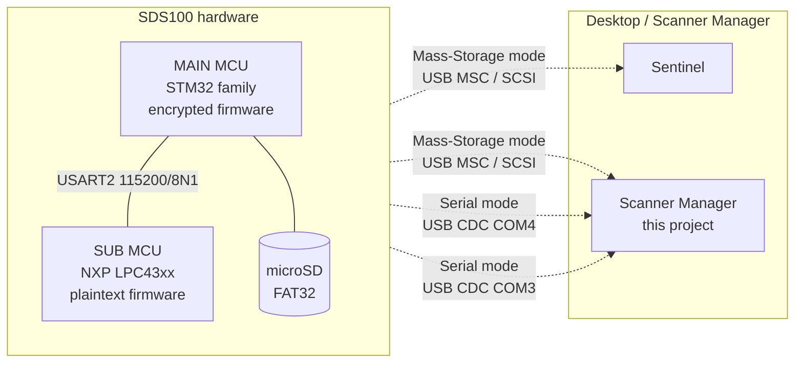

# Reverse Engineering

How the SDS100 (and the wider BCDx36HP scanner family) actually works
on the inside. This page is the **consolidated narrative**; every
sub-page below is a drill-down with raw data and decompiles.

> If you only read one page in this section, read this one. It tells
> you where Sentinel ends and where our app can keep going.

## Audience: this is the RE / Development tree

This whole section of the wiki is written for **contributors who want
to extend the scanner-side work** - add a new scanner family, port the
inter-MCU bus to a new MCU, capture another Sentinel operation, or
build something Sentinel can't (live RSSI heatmaps, DSP-tap recording,
in-app firmware update over USB MSC, etc.).

If you're just trying to use the app, you can skip this whole tree
and go back to [Home](Home).

If you're here to **build on the RE work**, the typical reading order
is:

1. [Architecture](RE-Architecture) - what the hardware actually is.
2. [USB Modes](RE-USB-Modes) - the two faces it shows the host.
3. Pick the surface you care about: [SD Card](RE-SD-Card),
   [Serial Protocol](RE-Serial-Protocol),
   [Inter-MCU Bus](RE-Inter-MCU-Bus), or [Firmware](RE-Firmware).
4. [Sentinel](RE-Sentinel) - what the vendor app does and where it stops.
5. [Toolchain](RE-Toolchain) and [Workflows](RE-Workflows) - the
   probes, decoders, and recipes.
6. [Virtual Scanner Roadmap](Virtual-Scanner-Roadmap) - the
   forward-looking plan for an SDR-backed software scanner that
   inherits everything we know.

**Lab notebook (repo):** [`Metacache/Dev/RE/`](../Metacache/Dev/RE/) holds
probe scripts, vendor specs, decompiles, and session captures. Safe
files ship on GitHub; see [`Metacache/EXPORT_POLICY.md`](../Metacache/EXPORT_POLICY.md).

## TL;DR

- The SDS100 has **two USB modes**: Mass Storage and Serial.
- **Mass Storage = FAT32 SD card** with the BCDx36HP-family file
  shapes. We know those shapes deeply from
  [BT885 vs SDS100 SD card RE](RE-SD-Card).
- **Sentinel = a desktop FAT32 editor**. Phase 0a/0c USB captures
  show Sentinel does **only** SCSI READ_10 / WRITE_10 on those exact
  files. No proprietary protocol. See [RE-Sentinel](RE-Sentinel).
- **Serial = two CDC ports** (`COM3` SUB, `COM4` MAIN). MAIN runs
  the documented Uniden Remote Command Protocol plus undocumented
  extensions; SUB runs a 13-command DSP/RF debug surface.
  See [RE-Serial-Protocol](RE-Serial-Protocol).
- **Sentinel never uses Serial.** It only ever speaks UMS.
- Therefore **our app, by speaking BOTH UMS and Serial, is a strict
  functional superset of Sentinel**. The "Mass Storage path"
  replicates everything Sentinel does; the "Serial path" gives us
  live RSSI, scan state, and DSP introspection that Sentinel cannot
  even see.

## How the surface fits together

Sentinel only ever sees the top two arrows. Our app can hit all
four, and the two extra arrows (Serial mode CDC) carry data Sentinel
never asked for: live RSSI, GSI XML, the 13 SUB-side debug streams
(ADC, FFT, NCO, gain registers...), and the inter-MCU USART2
control protocol.

## What we get from each surface

### From the SD card (Mass Storage)

The BCDx36HP family writes its entire persistent state into a
FAT32 volume at the canonical path `BCDx36HP/`. Identical folder
skeleton on BT885 and SDS100; the SDS100 just populates more of it.
Full shape table is in [RE-SD-Card](RE-SD-Card). The headlines:

| File | What it is | Round-trip-safe in our app? |
|---|---|---|
| `scanner.inf` | Identity + firmware versions | yes |
| `HPDB/hpdb.cfg` | State / county / agency master index | yes |
| `HPDB/s_*.hpd` | Per-state HPD payloads | yes |
| `favorites_lists/f_list.cfg` | Favorites manifest | yes |
| `favorites_lists/f_*.hpd` | Per-favorite payloads (DQK masks etc.) | yes |
| `profile.cfg` | Giant SDS100 settings (waterfall, GPS, weather, ...) | partial - 30+ record types, most preserved verbatim |
| `app_data.cfg` | Last-active scan state | yes (treat as ephemeral) |
| `discvery.cfg` (sic) | Discovery config stub | yes |
| `firmware/CityTable_*.dat`, `ZipTable_*.dat` | Firmware data tables | bit-identical across BT885/SDS100; never write |

Our HPD parser/writer at `scanner_manager.py:411-545`
already round-trips every record type observed on either card.

### From Sentinel's behaviour (also Mass Storage)

Sentinel's actual surface is **4 ops, not 6** (Backup/Restore are
just aliases for Read/Write; some Sentinel builds don't even
expose them as buttons). Every op reduces to standard FAT32 file
operations on the SD card we already understand. Captured pcaps
live under
`Metacache/Dev/RE/sentinel_pcaps`.

| Sentinel op | What it actually does | We replicate via |
|---|---|---|
| Read From Scanner | `READ_10` of `_*.hpd` records + `scanner.inf` + `profile.cfg` | Read the same files when SDS100 is mounted |
| Write to Scanner | `READ_10` existing files for diff, `WRITE_10` modified copies + FAT/dir updates | Same; the FAT mirroring is automatic when Windows owns the mount |
| Get HPDB Update | **Out-of-band FTP version check** ([RE-Update-Endpoints](RE-Update-Endpoints)), then `WRITE_10` of new HPDB blob *only if* outdated | List `ftp.homepatrol.com/BCDx36HP/`, find latest `MasterHpdb_*.gz`, compare to `hpdb.cfg`'s `DateModified`, drop new HPDs. **Zero USB traffic when up-to-date** (confirmed in capture). |
| Update Firmware | One `READ_10` of the `BCDx36HP/firmware/` directory entry (4 KB at LBA 0x4280), then **FTP version check** ([RE-Update-Endpoints](RE-Update-Endpoints)), then `WRITE_10` of new `.bin` (MAIN) or `.firm` (SUB) *only if* outdated | Walk `BCDx36HP/firmware/`, parse version-encoded filenames (`SDS-100_V1_05.bin` = MAIN v1.05; `_V1_03_05.firm` = SUB v1.03.05), FTP-check, drop new file. Bootloader picks it up at next reboot. See [RE-Firmware](RE-Firmware). |
| Backup (alias) | Same as Read From Scanner | Workspace snapshot |
| Restore (alias) | Same as Write to Scanner | Workspace push |

The SCSI/UMS/FAT32 decoder
(`Metacache/Dev/RE/tools/sentinel/decode_sentinel_pcap.py`)
turns each pcap into a per-op `summary.md` + `disk.bin` + `files.md`
so the "what does Sentinel do for op N" question answers itself.

### From Serial mode (CDC, two ports)

Sentinel does not enter Serial mode at all. When the user opts into
it (a button on the scanner power-up screen), they get **two CDC
virtual COM ports** instead of the FAT32 volume:

| Port | PID | MCU | Surface |
|---|---|---|---|
| `COM4` | `001A` | MAIN | Documented Uniden Remote Command Protocol (V1.02 + V2.00 specs) plus undocumented `GLT,SYS` and `GSI,PROP/FULL` extensions and 21 confirmed-vestigial mnemonics |
| `COM3` | `0019` | SUB | 13 single-character DSP/RF debug commands (`o q w d r m z h l s t u v`) plus `MDL`/`VER`. SUB-side dispatch is a per-character `cmp #imm8` chain inside `FUN_14006ca6`; full enumeration is in [RE-Serial-Protocol](RE-Serial-Protocol) |

The SUB port is a goldmine Sentinel ignores entirely. It gives us:

- **Live RF telemetry** - ADC peak-to-peak (`o`), buffer A/B I/Q
  (`q`, `w`), interleaved I/Q (`d`), audio post-filter (`r`),
  FFT magnitude (`m`), accumulator dump (`z`), 32-bit dual-stream
  (`v`).
- **Continuous H-stream** for monitoring (`h` emits paired
  `H, %ld, %ld` records).
- **Per-mode flag flips** (`t`, `u`) that control the format of
  other dumps - these are mode bits we can sweep to find out which
  registers/buffers each represents.
- **Identity** (`MDL` -> `SDS100-SUB`, `VER` -> sub firmware
  version), independent of MAIN.

### From firmware static RE (offline)

The MAIN firmware is **encrypted** (entropy 7.9999/8.0, every
chunk maxed; see [RE-Firmware](RE-Firmware)) and is a dead end
for static analysis. Don't burn cycles trying. The bootloader
decrypts in-place from a hardware-fused key.

The SUB firmware is **plaintext**. We extracted, Ghidra-imported,
and decompiled it; the SUB-side dispatch table (the 13 debug
commands above) and the inter-MCU USART2 protocol fell out
straight from the decompile. Round 1-5 narrative is in
[RE-Inter-MCU-Bus](RE-Inter-MCU-Bus).

## How our app exceeds Sentinel

| Capability | Sentinel | Our app | Why |
|---|:---:|:---:|---|
| Read/write favourites, channels, settings | yes | yes | Both speak FAT32; we use the same file shapes |
| Edit while scanner is detached | no (Sentinel needs scanner mounted) | yes ("Workspaces" / virtual SD) | Our MetaStore decouples edit from sync |
| Live RSSI / GSI / scan state | no | yes | Serial-mode COM4 (MAIN port) - Sentinel ignores Serial |
| ADC / FFT / NCO / gain dumps | no | yes (12 commands so far) | Serial-mode COM3 (SUB port) |
| Live H-stream monitoring | no | yes | SUB port `h` stream |
| Audit trail / undo of every change | no | yes | MetaStore event log |
| Bulk operations + revert | no | yes | Same |
| RadioReference import | no | yes | RR HTML + SOAP API client |
| Multi-scanner / family-wide | partial | yes | BT885 + SDS100 share the on-disk format |
| Detect destructive vs read-only commands | no | yes | Whitelist + forbidden-list in our probes |

The functional gap *into* Sentinel-only territory is at most: nicer
GUI for some niche editors. We close that gap as we add UI; we
already exceed Sentinel structurally.

## Status of the work

| Workstream | State | Drill-down |
|---|---|---|
| BT885 + SDS100 SD card RE | DONE | [RE-SD-Card](RE-SD-Card) |
| MAIN-port serial command catalog (V1.02 + V2.00 + BCDx36HP V1.05 + experimental) | DONE for read-only surface | [RE-Serial-Protocol](RE-Serial-Protocol) |
| SUB-port serial command catalog (13 debug commands + MDL/VER) | DONE | [RE-Serial-Protocol](RE-Serial-Protocol) |
| SUB firmware container + extraction | DONE | [RE-Firmware](RE-Firmware) |
| SUB firmware Ghidra import + analysis | DONE for SUB-side dispatch | [RE-Firmware](RE-Firmware) |
| Inter-MCU USART2 protocol | Layers 0-2 DONE; Layer 3 needs MAIN | [RE-Inter-MCU-Bus](RE-Inter-MCU-Bus) |
| Sentinel ops 1-2 captured + decoded | DONE (full read/write traces) | [RE-Sentinel](RE-Sentinel) |
| Sentinel ops 3-4 captured + decoded | DONE ("up-to-date" path - reveals out-of-band FTP version check + 4 KB FAT-dir read for firmware enumeration) | [RE-Sentinel](RE-Sentinel) |
| Update-check endpoints (Sentinel + BT885) | DONE - both apps use plain FTP with hardcoded creds; full inventory captured | [RE-Update-Endpoints](RE-Update-Endpoints) |
| Sentinel ops 5-6 (Backup/Restore) | DONE - **feature absent in user's Sentinel build**; backup/restore are aliases of read/write | [RE-Sentinel](RE-Sentinel) |
| Sentinel actual-update WRITE_10 traces | OPEN - need to capture during a real HPDB or firmware update | [RE-Sentinel](RE-Sentinel) |
| MAIN MCU firmware static RE | INFEASIBLE (encrypted) | [RE-Firmware](RE-Firmware) |
| MAIN MCU live USART2 capture | OPEN, needs case-open + logic analyser | [RE-Inter-MCU-Bus](RE-Inter-MCU-Bus) |

## Sub-pages

- [RE-Architecture](RE-Architecture) - Two-MCU layout, exactly how
  the hardware decomposes, mermaid diagrams.
- [RE-USB-Modes](RE-USB-Modes) - The two-mode boot prompt and how to
  enter each, what each looks like to Windows.
- [RE-SD-Card](RE-SD-Card) - The BCDx36HP FAT32 file system, every
  file we know how to parse, BT885 vs SDS100 diff.
- [RE-Serial-Protocol](RE-Serial-Protocol) - SUB + MAIN command
  catalogs, the documented spec surface plus our undocumented
  finds.
- [RE-Inter-MCU-Bus](RE-Inter-MCU-Bus) - USART2 framing between SUB
  and MAIN, derived from the SUB decompile.
- [RE-Firmware](RE-Firmware) - SUB container format, MAIN encryption
  status, version diffs.
- [RE-Sentinel](RE-Sentinel) - Sentinel = FAT32 editor. Op-by-op
  decoded behaviour and the API surface we replicate.
- [RE-Update-Endpoints](RE-Update-Endpoints) - Where Sentinel and the
  BT885 Update Manager actually fetch updates from (plain FTP, not
  the TWiki, not an HTTP API).
- [RE-Toolchain](RE-Toolchain) - Every script and Java post-script,
  grouped by purpose.
- [RE-Workflows](RE-Workflows) - Recipe playbooks for common RE
  tasks ("decode a fresh capture", "decompile one function",
  "diff two firmware versions", "verify a hypothesis on the
  scanner", ...).
- [Glossary](Glossary) - All the acronyms (combined with the
  general project glossary).

## Lab notebook

The wiki is the consolidated narrative. The lab notebook is
`Metacache/Dev/RE/` in the repo - raw probe captures, Ghidra projects,
decompiles, pcaps, sessions logs, and the scripts that produced
all of the above. The wiki cross-references files in there as
"raw data" links; never duplicates content.

> If a wiki claim disagrees with a file in `Metacache/Dev/RE/`, the file
> wins by default - it has the timestamp and the bytes. Fix the
> wiki to match, or update both with a session note explaining
> the change.
