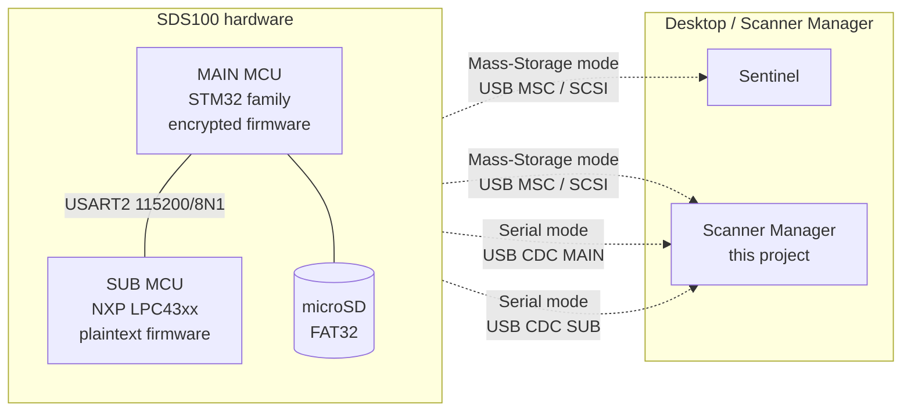

# Reverse Engineering

> Status: shipped (v0.11.x) — consolidated RE narrative; lab files in
> `Metacache/Dev/RE/` win on conflicts.

## What this answers

How the SDS100 (and the wider BCDx36HP family) works on the wire and
on disk — and why Scanner Manager can be a **strict functional
superset of Sentinel**. This page is the consolidated narrative;
sub-pages hold the deep dives.

Audience: **contributors** extending scanner-side work (new family,
inter-MCU bus, Sentinel capture, live DSP taps, virtual scanner).
End users: skip this tree and go back to [Home](Home).

## Known vs OPEN

| Workstream | State | Drill-down |
|---|---|---|
| In-app firmware updater (FTP + SD apply) | SHIPPED (v0.11.x) | [Firmware Updater](Firmware-Updater), [RE-Update-Endpoints](RE-Update-Endpoints) |
| SDS100/200 profile + multi-device GUI | SHIPPED (v0.11.x) | [Architecture](Architecture), `scanner_profiles/sds100.py` |
| Card profile detection (`detect_from_card`) | SHIPPED in Qt; legacy Tk manual | `scanner_profiles/registry.py` |
| BT885 + SDS100 SD card RE | DONE | [RE-SD-Card](RE-SD-Card) |
| MAIN-port serial catalog (V1.02 + V2.00 + BCDx36HP V1.05 + experimental) | DONE for read-only surface | [RE-Serial-Protocol](RE-Serial-Protocol) |
| SUB-port catalog (13 debug cmds + MDL/VER) | DONE | [RE-Serial-Protocol](RE-Serial-Protocol) |
| SUB firmware container + Ghidra dispatch | DONE | [RE-Firmware](RE-Firmware) |
| Inter-MCU USART2 protocol | Layers 0–2 DONE; Layer 3 needs MAIN | [RE-Inter-MCU-Bus](RE-Inter-MCU-Bus) |
| Sentinel ops 1–4 + Backup/Restore aliases | DONE (up-to-date paths for 3–4) | [RE-Sentinel](RE-Sentinel) |
| Update-check endpoints (Sentinel + BT885) | DONE — plain FTP | [RE-Update-Endpoints](RE-Update-Endpoints) |
| Sentinel actual-update WRITE_10 traces | OPEN — need a real HPDB/firmware update capture | [RE-Sentinel](RE-Sentinel) |
| MAIN MCU firmware static RE | INFEASIBLE (encrypted) | [RE-Firmware](RE-Firmware) |
| MAIN MCU live USART2 capture | OPEN — case-open + logic analyser | [RE-Inter-MCU-Bus](RE-Inter-MCU-Bus) |

## Deep dive

### Reading order

1. [Architecture](RE-Architecture) — two MCUs, buses, SD owner.
2. [USB Modes](RE-USB-Modes) — Mass Storage vs Serial.
3. Surface of interest: [SD Card](RE-SD-Card),
   [Serial Protocol](RE-Serial-Protocol),
   [Inter-MCU Bus](RE-Inter-MCU-Bus), or [Firmware](RE-Firmware).
4. [Sentinel](RE-Sentinel) — vendor app stops at UMS.
5. [Toolchain](RE-Toolchain) / [Workflows](RE-Workflows) — probes and recipes.
6. [Virtual Scanner Roadmap](Virtual-Scanner-Roadmap) — SDR-backed sketch.

### TL;DR

- **Two USB modes**: Mass Storage (FAT32 SD) and Serial (two CDC ports).
- **Mass Storage = BCDx36HP file shapes** we already parse
  ([RE-SD-Card](RE-SD-Card)).
- **Sentinel = desktop FAT32 editor.** Phase 0 captures show only
  SCSI READ_10 / WRITE_10. No proprietary protocol
  ([RE-Sentinel](RE-Sentinel)).
- **Serial = two CDCs** — MAIN (`PID 0x001A`) Uniden Remote Command
  Protocol; SUB (`PID 0x0019`) 13-char DSP/RF debug surface
  ([RE-Serial-Protocol](RE-Serial-Protocol)).
- **Sentinel never uses Serial.** Speaking both UMS and Serial makes
  this app a strict superset.

### How the surface fits together

Sentinel only sees the Mass-Storage arrows. Serial CDCs carry live
RSSI, GSI XML, SUB DSP dumps, and the inter-MCU control surface
Sentinel never asked for.

### What we get from each surface

**SD card (Mass Storage).** Canonical root `BCDx36HP/`. Identical
folder skeleton on BT885 and SDS100; SDS100 populates more of it.
Headlines: `scanner.inf`, `HPDB/`, `favorites_lists/`, `profile.cfg`,
`app_data.cfg`, `discvery.cfg` (sic), `firmware/CityTable_*.dat` +
`ZipTable_*.dat` (never write). Full table: [RE-SD-Card](RE-SD-Card).
`core/hpd.py` round-trips every observed HPD record type.

**Sentinel (also Mass Storage).** Real surface is **4 ops, not 6**
(Backup/Restore are aliases). Every op is FAT32 file I/O; version
checks for HPDB/firmware are **out-of-band FTP**
([RE-Update-Endpoints](RE-Update-Endpoints)). Decoder:
`Metacache/Dev/RE/tools/sentinel/decode_sentinel_pcap.py`.

**Serial mode.** Two CDCs by VID/PID (not by COM number):

| PID | MCU | Surface |
|---|---|---|
| `0x001A` | MAIN | Documented Remote Command Protocol + undocumented `GLT,SYS` / `GSI,PROP|FULL` |
| `0x0019` | SUB | `MDL`/`VER` + 13 single-char DSP/RF debug commands |

**Firmware static RE.** MAIN encrypted (dead end). SUB plaintext —
dispatch + USART2 framing fell out of the decompile
([RE-Firmware](RE-Firmware), [RE-Inter-MCU-Bus](RE-Inter-MCU-Bus)).

### How our app exceeds Sentinel

| Capability | Sentinel | Our app |
|---|:---:|:---:|
| Read/write favourites, channels, settings | yes | yes |
| Edit while scanner detached (workspaces) | no | yes |
| Live RSSI / GSI / scan state | no | yes (MAIN CDC) |
| ADC / FFT / NCO / gain dumps | no | yes (SUB CDC) |
| Audit trail / undo | no | yes |
| RadioReference import | no | yes |
| Multi-scanner family | partial | yes |
| SDS100 profile (`Sds100Profile`) | no | **yes (v0.11.x)** |
| In-app firmware updater (FTP + SD drop) | no | **yes (v0.11.x)** |
| Card auto-detection | no | **yes in Qt** |

### Sub-pages

- [RE-Architecture](RE-Architecture) — two-MCU layout
- [RE-USB-Modes](RE-USB-Modes) — boot prompt and host topology
- [RE-SD-Card](RE-SD-Card) — BCDx36HP FAT32 shapes
- [RE-Serial-Protocol](RE-Serial-Protocol) — MAIN + SUB catalogs
- [RE-Inter-MCU-Bus](RE-Inter-MCU-Bus) — USART2 framing
- [RE-Firmware](RE-Firmware) — SUB container, MAIN encryption, SD apply
- [RE-Sentinel](RE-Sentinel) — UMS editor decode
- [RE-Update-Endpoints](RE-Update-Endpoints) — plain FTP update hosts
- [RE-Toolchain](RE-Toolchain) — script inventory summary
- [RE-Workflows](RE-Workflows) — recipe playbooks
- [Virtual-Scanner-Roadmap](Virtual-Scanner-Roadmap) — SDR sketch
- [Glossary](Glossary)

## Lab pointers

| Path | Role |
|---|---|
| [`Metacache/Dev/RE/README.md`](../Metacache/Dev/RE/README.md) | Lab index + wiki↔lab table + probe safety contract |
| [`Metacache/Dev/RE/docs/`](../Metacache/Dev/RE/docs/) | Canonical lab notebooks |
| [`Metacache/Dev/RE/tools/`](../Metacache/Dev/RE/tools/) | Probes, firmware analyzers, Sentinel decoders, Ghidra glue |
| [`Metacache/Dev/RE/sessions/`](../Metacache/Dev/RE/sessions/) | Raw probe logs (local / gitignored; promote sanitized notes to `docs/`) |
| [`Metacache/EXPORT_POLICY.md`](../Metacache/EXPORT_POLICY.md) | GitHub vs GitLab export tiers |

> If a wiki claim disagrees with a file under `Metacache/Dev/RE/`,
> the lab file wins (timestamp + bytes). Fix the wiki.
